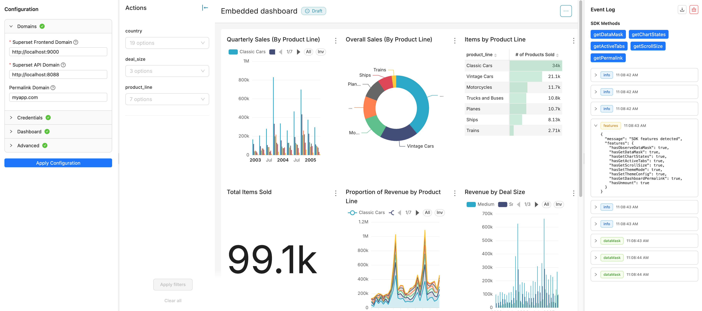

# Superset Embedded Demo

An application showing how to embed Apache Superset dashboards using the `@superset-ui/embedded-sdk`.



## Features

- **Three-panel resizable layout**: Configuration panel, embedded dashboard, and event log
- **SDK version resilience**: Automatically detects available SDK features and gracefully handles missing methods
- **Monaco Editor**: JSON editors for RLS rules and UI configuration with syntax highlighting
- **Real-time event logging**: Monitor SDK events and method responses
- **Guest token authentication**: Securely authenticate with Superset using admin credentials
- **Tooltips**: Comprehensive help text for all configuration options

## Prerequisites

- Node.js 18+ and npm
- A running Superset instance with:
  - Embedded dashboard configuration enabled
  - A dashboard configured for embedding
  - Admin user credentials

## Installation

```bash
# Install all dependencies (root, client, and server)
npm install
```

## Running the Application

### Development Mode

Run both frontend and backend concurrently:

```bash
npm run dev
```

Or run them separately:

```bash
# Terminal 1: Run frontend (http://localhost:3000)
npm run dev:client

# Terminal 2: Run backend (http://localhost:3001)
npm run dev:server
```

### Production Build

```bash
npm run build
```

## Configuration

### Backend Environment Variables

Create a `.env` file in the root directory (optional):

```bash
# Server port (default: 3001)
PORT=3001
NODE_ENV=development

# ==========================================
# JWT Authentication (Optional)
# ==========================================
# When configured, the server will generate guest tokens locally
# instead of requesting them from Superset's API.
# This is useful when running behind an authenticating reverse proxy.

# Path to a file containing the JWT signing secret (preferred)
GUEST_TOKEN_SECRET_FILE=/path/to/secret

# Or provide the secret inline (for development only)
GUEST_TOKEN_SECRET=your-secret-key

# JWT audience claim (optional, must match Superset's GUEST_TOKEN_JWT_AUDIENCE)
GUEST_TOKEN_AUDIENCE=https://superset.example.com

# Token expiration in seconds (default: 300 = 5 minutes)
GUEST_TOKEN_EXPIRATION_SECONDS=300

# HTTP header name for authenticated username
# Set by the reverse proxy after authentication
JWT_USERNAME_HEADER=x-username

# ==========================================
# Pre-configured Domains (Optional)
# ==========================================
# When set, these values are used automatically and the corresponding
# UI inputs are hidden from the configuration panel.

# Superset frontend domain (where the iframe loads from)
SUPERSET_FRONTEND_DOMAIN=http://localhost:9000

# Superset API domain (where tokens are requested from)
SUPERSET_API_DOMAIN=http://localhost:8088

# Permalink domain (for resolving dashboard permalinks)
PERMALINK_DOMAIN=http://localhost:9000
```

### Authentication Modes

The application supports two authentication modes:

**1. Superset API Authentication (Default)**
- User enters Superset username/password in the UI
- Server requests guest tokens from Superset's `/api/v1/security/guest_token/` endpoint

**2. JWT Signing (When `GUEST_TOKEN_SECRET` or `GUEST_TOKEN_SECRET_FILE` is set)**
- Server generates guest tokens locally using a shared secret
- Username is obtained from an HTTP header (set by reverse proxy)
- No credentials UI is shown to the user

### Superset Setup

1. Enable embedded dashboards in your Superset instance
2. Configure a dashboard for embedding (get the embed ID)
3. Ensure your user has `can_grant_guest_token` permission
4. Note your dashboard's UUID

## Usage

1. **Start the application**: Run `npm run dev`
2. **Open your browser**: Navigate to http://localhost:3000
3. **Configure connection** (if not pre-configured via environment variables):
   - Enter your Superset frontend domain (e.g., http://localhost:9000)
   - Enter your Superset API domain (e.g., http://localhost:8088)
   - Enter username and password (unless JWT auth is enabled)
4. **Configure dashboard**:
   - Enter the dashboard embed ID (from Superset's embed configuration)
5. **Configure options** (optional):
   - Add RLS rules as JSON array
   - Customize UI config as JSON object
6. **Click "Apply Configuration"** to embed the dashboard
7. **Monitor events**: View SDK events and responses in the right panel
8. **Test SDK methods**: Use the buttons in the event panel to call SDK methods

## Project Structure

````
superset-embedded-demo/
├── client/                 # React frontend
│   ├── src/
│   │   ├── components/    # React components
│   │   ├── services/      # API client
│   │   ├── styles/        # CSS styles
│   │   ├── types/         # TypeScript types
│   │   ├── App.tsx        # Main app component
│   │   └── main.tsx       # Entry point
│   └── package.json
├── server/                # Express backend
│   ├── src/
│   │   ├── middleware/   # Express middleware
│   │   ├── routes/       # API routes
│   │   ├── services/     # Business logic
│   │   └── index.ts      # Entry point
│   └── package.json
└── package.json          # Workspace root

## SDK Methods Demonstrated

- `embedDashboard()`: Embed a dashboard in an iframe
- `observeDataMask()`: Listen for filter changes
- `getDataMask()`: Get current filter state
- `getChartStates()`: Get state of all charts
- `getActiveTabs()`: Get currently active tabs
- `getScrollSize()`: Get dashboard dimensions
- `getDashboardPermalink()`: Get permalink URL
- `unmount()`: Remove the embedded dashboard


## Development

### Using a Local SDK

To test with a local version of `@superset-ui/embedded-sdk`:

```bash
# In client/package.json, replace:
"@superset-ui/embedded-sdk": "^0.3.0"

# With the path to your local SDK:
"@superset-ui/embedded-sdk": "file:../../superset/superset-embedded-sdk"

# Then reinstall dependencies
npm install
````

## License

MIT
